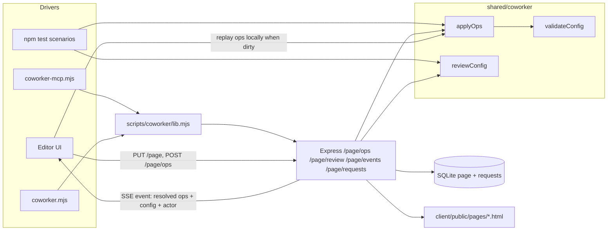
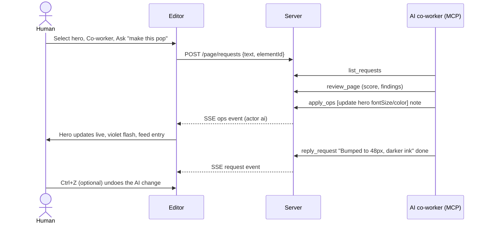

# AI co-worker + quality loop

One harness, three drivers. The same op vocabulary and review rules are used by:

| Driver | How it talks to the board |
|--------|---------------------------|
| **Human** | Editor UI (drag, inspector, Co-worker panel "Fix" / "Ask") |
| **AI co-worker** | MCP server `scripts/coworker-mcp.mjs` (Cursor agent) or CLI `scripts/coworker.mjs` |
| **Tests / QA** | `npm test` (in-process ops + review), `coworker check` (live gate), `coworker look` (real browser) |

If a check passes for the test harness, it passes for the AI — they call the same
functions. If the AI can do something, a test can script it.

Figma analogy: the board is the live page; the AI is a second cursor. Human leaves a
**request** (like a Figma comment, optionally pinned to an element); the AI reads it,
applies ops, replies. Every AI change streams to open editors, flashes the touched
elements, and is one Ctrl+Z away.

---

## Plan (ordered, each step verifiable)

| # | Task | Acceptance | Verify | Status |
|---|------|------------|--------|--------|
| 1 | Shared element defaults | Client + `configToHtml` use one `shared/elementDefaults.js` | goldens unchanged, `npm test` | Done |
| 2 | Op vocabulary `shared/coworker/ops.js` | `applyOps(config, ops)` atomic; insert/update/delete/move/group/ungroup/setPage; resolved ops carry ids | unit tests | Done |
| 3 | Schema `shared/coworker/schema.js` | `validateConfig` → errors (block) + warnings; unknown keys rejected in ops | unit tests | Done |
| 4 | Review `shared/coworker/review.js` | Findings `{rule, severity, elementId, message, fix?}` + score; auto-fix ops | unit tests; seeds reviewed | Done |
| 5 | Server | `POST /page/ops`, `GET /page/review`, `GET /page/events` (SSE), requests CRUD, `PUT /page` validation, `version` | `coworker` CLI against live server | Done |
| 6 | CLI + MCP | Same `scripts/coworker/lib.mjs` behind both | MCP handshake + tool call smoke | Done |
| 7 | Editor live sync + Co-worker panel | AI ops appear live, one undo entry, flash; activity feed; review list with Fix; Ask box | Browser walkthrough | Done |
| 8 | Quality loop | Run `coworker check` + `look` on both presets; fix what fails (seeds + code) until gate is green | gate output, screenshots | Done |

Gate ("what we want"): **0 errors, score ≥ 90** on every preset, `npm test` green,
HTML write-back in sync with JSON, no layout findings from `look`. Run it with `npm run check`.
Current results: demo 100, marketplace 100 (see [QA.md](QA.md)).

## Using it

| As | Do |
|----|----|
| Human | Editor → **Co-worker** (or ⌘⇧A): select an element, pick feel chips and/or type a specific ask, ⌘/Ctrl+Enter. Review tab: Fix / Fix all / Ask. Activity: who changed what. Toolbar **Desk / Tab / Phone** frames the canvas (saved as `viewport`) |
| Auto pickup | Asking on the board queues the request + writes `.editlayer/auto-dispatch.json`. **sessionStart** injects open requests into a new Agent session; **stop** (after an agent turn finishes) can auto-follow-up up to 2 times. Idle chat with no agent turn = no pickup — send “go” (or any message) in Agent after Ask. |
| AI (Cursor) | `.cursor/mcp.json` registers `editlayer`. Design tools only: `get_design_session`, `set_design_session`, `list_requests`, `look_request`, `get_design_brief`, `comment`, `reply_request`, `activity`. Turn the session on to show the overlay. `comment` opens a pin as the agent. `intent.frame` is the screenshot width. Board ops (`get_page`, `apply_ops`, `review`, `fix`, `look`) stay on the CLI |
| AI / script (shell) | `npm run coworker -- <command>` (`get`, `ops`, `review`, `fix`, `look`, `requests`, `reply`, `watch`, …) |
| Tests | `npm test` (scenarios in-process), `npm run check` (live gate), `coworker scenario <file>` (live, restores) |

---

## Data flow

## User experience

Before: AI edits meant hand-writing full `PUT /page` JSON and reloading the tab.
After: AI works on the open board like a second cursor; human sees, reviews, undoes.

---

## Op vocabulary

| Op | Shape | Notes |
|----|-------|-------|
| `insert` | `{op, element:{type,...}, parentId?, afterId?}` | id assigned if missing; defaults via type seeds |
| `update` | `{op, id, set:{...}}` | cannot set `id`, `type`, `children` |
| `delete` | `{op, ids:[...]}` | recursive |
| `move` | `{op, id, parentId?, afterId?}` | reparent / reorder; `parentId:null` = root |
| `group` | `{op, ids:[...], name?}` | siblings → new frame; result id |
| `ungroup` | `{op, id}` | lifts children with offsets |
| `setPage` | `{op, set:{pageBackground}}` | page-level fields |

All ops in one call are atomic: any error → nothing saved, error names the op index.

## Review rules

| Rule | Severity | Auto-fix |
|------|----------|----------|
| `schema` | error | — |
| `contrast` | error (< 3:1) / warn (< AA) | nearest passing ink |
| `empty-content` | warn | — |
| `image-alt` | warn | — |
| `min-font-size` | warn (< 12px) | 12px |
| `tap-target` | warn (button < 24px tall) | padding |
| `link-href` | info | — |
| `heading-order` | warn | demote extra h1 to level 2; fill skipped levels |
| `html-sync` | error (server only) | re-save |
| `layout-*` | warn (browser `look` only) | — |

Score = 100 − 15·errors − 5·warnings − 1·info (floor 0).
