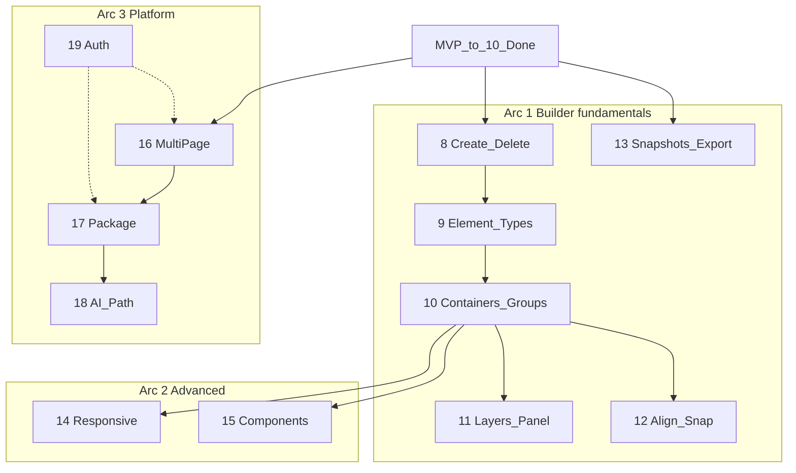

# Development

How we build this project — philosophies, practices, and skill usage.
Product truth lives in sibling docs; this file is **how we work**.

| Doc | When to update |
|-----|----------------|
| [SPEC.md](SPEC.md) | Scope, goals, phases, decisions |
| [DESIGN.md](DESIGN.md) | UX, visual language, interactions |
| [ARCHITECTURE.md](ARCHITECTURE.md) | Stack, components, data flow, schema |
| [API.md](API.md) | Endpoints, payloads |
| **DEVELOPMENT.md** | Process, principles, skill workflow (this file) |

---

## Docs scale with you

Documentation is not a one-time bootstrap — it grows every conversation.

- Update the relevant doc **in the same turn** as the decision or implementation.
- Reflect what was **actually built**, not just what was planned (note tech swaps, deferrals).
- Keep [README.md](README.md) index accurate when docs are added or removed.
- No placeholder slop (`TBD`, lorem ipsum). If unknown, ask — don't invent.

Enforced via `.cursor/rules/working-agreements.mdc` (always applied).

---

## Phase workflow

Each phase follows the same loop:

```
1. Read SPEC + DESIGN + relevant skills
2. Plan (Plan mode for scope/reframing) → ordered tasks + acceptance criteria
3. Implement smallest vertical slice
4. Update docs same turn
5. Verify (build, manual check, browser if UI)
```

Phases stay **narrow**. If a phase feels like two phases, split it (see MVP restructure).

### Build plan format (required)

Every phase plan must include **two diagrams**:

1. **Data flow** — how code/state moves (components, API, DB).
2. **User experience** — how the tool feels to use (sequence diagram: user action → UI response → canvas update).

The UX diagram answers: *what does this phase change for the person using the editor?*
Include a short before/after note when the interaction model shifts.

---

## Parallel subagents (build sprints)

Phases stay **sequential** — each one can reshape the shared core (`elementDefaults.js`,
`App.jsx`, `InspectorPanel.jsx`, `PageRenderer.jsx`, `db.js`, the config schema), so
parallel full-phase builds would collide and cause rework.

**The model: plan sequentially, fan out *within* an approved phase.**

```
1. Plan the phase (Plan mode, approval)        ← sequential
2. Define the contract (schema + component API) ← sequential, locks shared shape
3. Batch subagents on NON-overlapping slices    ← parallel
4. Integrate + verify + docs same turn          ← sequential
```

### Safe to batch (parallel subagents)

- Slices that touch **different / new files** (a new hook, a new component, an icon set)
- Tests for already-built phases (`webapp-testing`)
- QA pass + screenshots (`agent-browser`)
- Docs work (data-flow + UX diagrams)
- Design exploration via `best-of-n-runner` — 2-3 isolated worktrees prototyping
  competing approaches for a risky phase, then compare (per *exhaust-the-design-space*)

### Do NOT batch

- Two subagents editing the **same** shared file (`App.jsx`, `elementDefaults.js`, etc.)
- Phases in a dependency chain (e.g. container model in Phase 8 before drag in Phase 6)
- Anything before the phase contract (schema + component API) is locked

### Rule of thumb

If two slices would edit the same file or depend on an unsettled schema, they are
**sequential**. Otherwise they can run as a batch. Define the contract first, then parallelize
(see `planning-and-task-breakdown` → Parallelization Opportunities).

---

## Coding principles

1. **Minimize scope** — smallest correct diff; no drive-by refactors.
2. **Match conventions** — read surrounding code before writing; reuse existing patterns.
3. **Flat schema until proven otherwise** — element properties stay flat on JSON objects; defaults in `mergeElement()`.
4. **Backward compatible** — new fields get defaults; old saved configs keep working.
5. **No new deps without reason** — prefer native HTML, inline SVG, CSS tokens over libraries.
6. **Prove it works** — build succeeds; persistence loop tested; don't declare done on "it compiles".

---

## Skill usage

Read the skill's `SKILL.md` **before** doing related work — don't work from memory.

### Project skills (`.agents/skills/`)

| Skill | Use when |
|-------|----------|
| `planning-and-task-breakdown` | Planning, scope, task breakdown, reframing |
| `pi-planning-with-files` | Large multi-feature work (5+ tool calls) |
| `find-skills` | No existing skill fits the phase — search and install |
| `frontend-design` | Building or restyling UI |
| `web-design-guidelines` | UI/UX quality review |
| `vercel-react-best-practices` | Writing/reviewing React |
| `vercel-composition-patterns` | Component architecture |
| `webapp-testing` | Automated web testing |
| `agent-browser` | Browser verification, screenshots |

### When a skill can't handle the scope

1. Check the project skills table above.
2. Run **find-skills**: `npx skills find [query]` or browse [skills.sh](https://skills.sh/).
3. Verify quality (install count, source reputation) before recommending.
4. Install to `.agents/skills/` if approved: `npx skills add <owner/repo@skill> -y`.
5. Document the new skill in this file and `.cursor/rules/working-agreements.mdc`.

### Cursor plugin skills (global)

| Skill / mode | Use when |
|--------------|----------|
| `/poteto-mode` | Long autonomous runs, multi-phase work, concise verified delivery. Reads poteto principles (laziness protocol, prove-it-works, experience-first). Not installed in repo — invoke via Cursor plugin. |
| `typescript-best-practices` | Editing `.ts` / `.tsx` (when we add TypeScript) |

For Phase 3 UI restyle we use: `frontend-design`, `planning-and-task-breakdown`, optionally `web-design-guidelines` for review.

---

## External references

| Reference | What it informs |
|-----------|----------------|
| [Figma SDS](https://github.com/figma/sds) | Two-layer token model (Phase 17), react-aria-components pattern, Icon wrapper, per-component CSS scoping, Code Connect workflow, Storybook setup |
| [Figma MCP server](https://github.com/figma/mcp-server-guide) | Dev workflow (design → code in Cursor); Phase 18 AI path architecture template |
| [Figma Code Connect](https://github.com/figma/code-connect) | Design-to-code component linking (Phase 17 stretch) |

**Key takeaways from Figma org review (Jun 2026):**

1. **Token model** — SDS separates color primitives from semantic aliases. Adopt before Phase 17 packaging. See `docs/DESIGN.md → Design System Roadmap`.
2. **Accessibility gaps** — Our Slider, ChipGroup, SwatchInput lack ARIA. react-aria-components fixes this in Phase 17. Gaps are documented in `docs/DESIGN.md → Accessibility`.
3. **Icon wrapper** — Add an `Icon` component with a `size` prop to standardize icon sizing.
4. **Code Connect** — If we ever produce a Figma file for the editor chrome, SDS's `figma.config.json` pattern keeps components linked to design nodes in Dev Mode.
5. **Storybook** — Add to Phase 17 scope for package documentation.
6. **Figma MCP server** — Two distinct uses (see below).

### Figma MCP server: two uses for this project

**Use 1 — Dev workflow (now):** The Figma MCP server lets Cursor agents read Figma design files and translate them into code. Install the Cursor plugin to enable it:

```
/add-plugin figma
```

This is useful any time a phase is designed in Figma first (e.g. a Figma mockup of the Phase 12 alignment UI). The agent can read the Figma frame and generate our editor component code, mapping Figma's output tokens to our `tokens.css` variables.

Best practices that apply to our workflow (from the [guide](https://github.com/figma/mcp-server-guide#write-effective-prompts-to-guide-the-ai)):
- Name Figma layers semantically (e.g. `AlignmentToolbar`, not `Group 5`)
- Use Figma variables for spacing/color so the MCP can map them to our CSS tokens
- Break screens into components before asking the agent to generate code
- Prompt: *"Translate this frame using our `tokens.css` variables and existing component patterns in `client/src/components/`"*

**Use 2 — Phase 18 architecture (planned):** Figma's MCP server is the reference model for how our own editor should expose itself to AI agents. Full design in `docs/ARCHITECTURE.md → Phase 18 AI path design`.

---

## Clarifications

When scope, intent, or a tradeoff is ambiguous — **ask before acting**.
Prefer a short multiple-choice question over guessing.
Confirm destructive or scope-expanding actions.

Planning/scope work: **Plan mode first**, explicit approval before code.

---

## Local dev

```bash
# Terminal 1 — API (port 3001)
cd server && npm start

# Terminal 2 — client (port 5173)
cd client && npm run dev
```

Server uses Node's built-in SQLite (`--experimental-sqlite`). DB file: `server/data.db`.

---

## Repo layout (app)

```
client/src/
  components/     # Editor chrome + field controls (SwatchInput, SelectionOverlay, …)
  icons/          # Inline SVG icon components
  styles/         # Design tokens (tokens.css)
  hooks/          # useConfigHistory (undo/redo)
  elementDefaults.js
  elementClipboard.js
  elementFactory.js
  elementTree.js      # group, ungroup, tree update, align children
  PageRenderer.jsx
  App.jsx
server/
  index.js        # GET/PUT /page
  db.js           # SQLite seed + read/write
docs/             # Product + dev truth
.agents/skills/   # Agent skills
.cursor/rules/    # Always-applied working agreements
```

---

## Project roadmap

**Where we are:** Phases MVP through **11** are shipped. The editor has a **layers panel** (tree, visibility, lock, rename, drag reorder), **page background**, insert-into-frame, and context menu Group/Ungroup. **Next up: Phase 12** (alignment, snapping & guides).

Full acceptance criteria live in [SPEC.md](SPEC.md). This section is the dev-facing outline.

### Completed

| Phase | Status | What shipped |
|-------|--------|--------------|
| **MVP** | Done | Edit toggle, click-to-select, text/color/size, save → SQLite, refresh persists |
| **2** | Done | Full inspector: background, opacity, padding, margin, border |
| **3** | Done | Design tokens, system theme, SVG icons, toolbar + flush-right inspector, `EditorShell` |
| **4** | Done | `SwatchInput`, `ChipGroup`, color popover, alignment chips, `textAlign` |
| **5** | Done | Auto-save (600ms), undo/redo (Ctrl+Z/Y), Revert to session start, continuous-edit batching |
| **6** | Done | Hybrid positioning (`offsetX/Y`, `width`/`height`), drag + 8-handle resize (`react-moveable`), text wrap |
| **7** | Done | Clipboard (Ctrl+C/X/V/D), context menu, paste at cursor, cut = copy + remove (one undo) |
| **7b** | Done | Shift+click multi-select, group drag, multi-select inspector hint; cut/copy all selected |
| **8** | Done | + Insert menu, Delete/Backspace, arrow nudge, empty-page placeholder, `elementFactory` |
| **9** | Done | Expanded types: image (upload + URL), button, link, divider, list; type-aware `mergeElement` |
| **10** | Done | Containers: `children[]`, group/ungroup, align grid, `elementTree.js` |
| **11** | Done | Layers panel, page background, full z-order (forward/back/front/back), insert-into-frame, context Group/Ungroup |

### Upcoming (ordered)

Three arcs. Full per-phase drafts (requirements, schema impact, UX, risks) live in
[SPEC.md](SPEC.md) → Future Scope. This table is the sequencing + dependency view.

**Arc 1 — Builder fundamentals (next)**

| Phase | Status | Scope | Depends on | Schema impact |
|-------|--------|-------|------------|---------------|
| **8** | Done | Element creation & deletion — insert palette, Delete, arrow nudge |
| **9** | Done | **Expanded element types** — image, button, link, divider, list |
| **10** | Done | **Containers & formal groups** — frame, group/ungroup, align children |
| **11** | Done | **Layers panel** — left tree, reorder/z-order, visibility, lock, rename; **page background**; insert-into-frame; context Group/Ungroup | 10 | Small |
| **12** | **Next** | **Alignment, distribution, snapping & guides**; **+** cross-parent group (from 10 deferral) | 7b, 10 | None |
| **13** | Planned | **Snapshots, export & HTML write-back** — `configToHtml` + overwrite mapped file on save; **+** asset manager UI (from 9 deferral) | 9–10 | New `snapshots` store; `sourcePath` per page |

**Arc 2 — Advanced editing**

| Phase | Status | Scope | Depends on | Schema impact |
|-------|--------|-------|------------|---------------|
| **14** | Planned | **Responsive breakpoints**; **+** auto-layout/flex containers, **scrollable frames + scrollbar editing** (from 10 deferral) | stable schema; 10 | **Major (overrides map)** |
| **15** | Planned | **Components / symbols**; **+** rich text stretch (from 9–10 deferral) | 8, 10 | Moderate (registry + instance) |

**Arc 3 — Platform & delivery**

| Phase | Status | Scope | Depends on | Schema impact |
|-------|--------|-------|------------|---------------|
| **16** | Planned | **Multi-page + page registry** — `GET/PUT /pages/:slug`, switcher | stable editor | Storage (`pages` table) |
| **17** | Planned | **`<VisualEditor>` package**; **+** button form validation hooks (from 9–10 deferral) | 9–12 stable; 16 for slugs | None |
| **18** | Planned | **AI read/write path** — same API + JSON contract, server validation | schema locked (post 10/14) | None new |
| **19** | Planned | **Auth & access control** — protect writes, roles | before public/multi-user | Storage (users/sessions) |

### Deferred from Phases 9–10

Scheduled in later phases — not dropped. Full table in [SPEC.md](SPEC.md#deferred-from-phases-910).

| Target | Items |
|--------|-------|
| **11** | Insert into selected frame; context menu Group/Ungroup; **page background color** (root page settings) | **Done** |
| **12** | Group across different parent levels |
| **13** | Asset manager UI (browse/delete uploads) |
| **14** | Auto-layout / flex containers; scrollable frames + scrollbar styling |
| **15** | Rich text (stretch) |
| **17** | Button form validation (stretch, embed/host) |

### Parked (not scheduled)

| Item | Notes |
|------|-------|
| System clipboard (cross-tab) | In-memory clipboard only for now |
| Rotation | Drag + resize only for now |
| In-app theme / token editing | Considered, not selected for current roadmap |
| Field-control backlog (no phase yet) | Per-side padding link/unlink; box-shadow; gradients; multiple fills — see [SPEC.md](SPEC.md) Future field controls |

### Phase dependency sketch



**Schema-shaping milestones** (plan carefully in Plan mode): **10** (nesting) and **14** (responsive overrides). Everything downstream of them should wait until each contract is locked.

### Phase 8 verification checklist

Manual checks after each Phase 8 change (or before calling the phase done):

| Check | Expected |
|-------|----------|
| `npm run build` | Passes |
| + Insert → Heading | New heading appears near cursor, selected, editable in inspector |
| + Insert → Paragraph | Same for paragraph |
| Delete all elements | Empty-page placeholder shows |
| Delete / Backspace | Removes selected; one Ctrl+Z restores |
| Multi-select + Delete | All selected removed; one undo restores all |
| Arrow keys | Nudge 1px; Shift+arrow 10px; one undo per keypress |
| Delete while typing in inspector | No delete (input still works) |
| Context menu → Delete | Same as Delete key |
| Refresh after add/delete | Change persisted via auto-save |

### MCP Marketplace test canvas

A second preset page (`marketplace`) ships for realistic editor testing — hero copy, divider, and three tool cards (containers with nested heading/paragraph/button).

| How to open | URL / action |
|-------------|----------------|
| Hash route | `http://localhost:5173/#/marketplace` |
| Toolbar | **Demo** / **MCP Marketplace** tabs (view mode only) |

Seeds live in `seeds/demo.js` and `seeds/mcpMarketplace.js`. Switching presets calls `POST /page/preset` and resets the editor session (exits edit mode, clears undo). On load, the app restores the **last saved** config from SQLite and syncs the URL hash — it no longer reloads a seed just because the hash differed.

### Why edits can look reverted (today)

**Today** there is no HTML write-back yet — only JSON in SQLite (`server/data.db`), rendered by React. Phase 13 adds the HTML file sync. Until then, if content looks reset:

| Cause | What happened |
|-------|----------------|
| **Switched Demo ↔ MCP Marketplace** | Toolbar tabs call `POST /page/preset`, which **replaces** the saved config with that preset's seed. Intentional reset. |
| **Opened a different URL than last time** | Previously, opening `http://localhost:5173/` while last save was on Marketplace could reload the Demo seed and overwrite the DB. **Fixed:** init now restores the last saved config and syncs the hash. |
| **Server was not running** | Edits stay in the browser only; auto-save fails (toolbar shows "Save failed"). Restart server and edit again. |
| **Single DB row** | Demo and Marketplace share one `page` row — only the **last saved** preset's config is kept until Phase 16 (multi-page). |

Wait for **Saved** in the toolbar before closing. Use the same preset tab (or `#/marketplace`) when returning.

### Dual persistence: JSON + HTML write-back (Phase 13)

**Today:** only JSON in SQLite. React renders the live page from config — no HTML file in your repo updates on save.

**Target (Phase 13):** keep visual editing on the live page, but **also** translate config → HTML on every save and overwrite the mapped file in the project:

```
Edit (visual)  →  config JSON  →  SQLite (source of truth for editor + AI)
                              └→  configToHtml()  →  e.g. client/public/pages/marketplace.html
```

| Layer | Role |
|-------|------|
| **JSON (DB)** | Undo, AI, inspector, structured edits — canonical for the editor |
| **HTML (disk)** | What you commit, deploy, or open outside the app — generated output, replaced on save |

Each page/preset gets a `sourcePath` (configured in seeds or page registry). Server resolves paths only under `PROJECT_ROOT`. Hand-editing the generated HTML is allowed but the next save from the editor overwrites it — same as codegen tools.

**Not in scope for v1 write-back:** parsing edited HTML back into JSON (one-way export). React/JSX export is a stretch after static HTML works.

### Automated verify (disposable)

For phases 9–10, a one-shot script tested pure tree logic + API round-trip, then was removed per dev hygiene. Pattern to recreate:

1. Import `elementTree.js` + `elementDefaults.js` in a Node script under `client/scripts/`.
2. Assert group/ungroup offsets, merge defaults, nested delete.
3. Optionally `PUT /page` nested config, `GET`, restore seed config.
4. Delete the script when green; keep manual checklist below.

### Phase 9–10 verification checklist (manual)

| Check | Expected |
|-------|----------|
| `npm run build` | Passes |
| + Insert → each new type | Image, Button, Link, Divider, List appear near cursor, selected |
| Image upload | File upload sets `src` to `/assets/…` URL; image renders |
| Image URL field | External URL loads in canvas |
| Button / Link inspector | Label or text, href, target chips update preview |
| Divider | Thickness + color change the line |
| List | Items textarea (one per line); Bullets vs Numbers toggle |
| Old saved config | Heading + paragraph still render (backward compat) |
| Copy/paste new types | Clone keeps type-specific fields |
| Refresh | All types persist via auto-save |

### Phase 10 verification checklist

| Check | Expected |
|-------|----------|
| + Insert → Frame | Empty container at cursor; drag/resize works |
| Shift+click two root elements → Ctrl+G | One frame wrapping both; children rebased |
| Select frame → Ctrl+Shift+G | Children return to root with correct page offsets |
| Drag frame | Children move with frame |
| Select frame → Align grid | Child positions update inside frame |
| Delete nested child | Frame remains; child gone |
| Copy/paste frame | Children get new ids |
| Refresh | Nested JSON persists |

### Phase 11 verification checklist

| Check | Expected |
|-------|----------|
| `npm run build` | Passes |
| Edit → Layers panel | Left tree lists Page + nested elements |
| Click layer row | Selects element on canvas; inspector opens |
| Click Page row / empty canvas | Page inspector with background swatch |
| Eye icon | Toggles `hidden`; element disappears from canvas (still listed in layers) |
| Lock icon | Clears selection; element cannot be clicked, dragged, or nudged |
| Rename (layers double-click, ✎ button, or inspector Name) | Persists after refresh; duplicates auto-labeled "Frame (1)", "Frame (2)" within same parent |
| Drag layer row | Blue line on drop target; stack order (`zIndex`) updates on release — layout positions unchanged |
| Ctrl+] / Ctrl+[ | Bring forward / send backward |
| Ctrl+Shift+] / Ctrl+Shift+[ | Bring to front / send to back |
| Inspector → Layer order | Four stacking actions for selected element |
| Context menu (element) | Bring to front, forward, backward, send to back |
| Reorder / z-order while selected | Selection border stays on element and stacks with it |
| Select frame → + Insert | New element lands inside frame |
| Context menu Group / Ungroup | Same as Ctrl+G / Ctrl+Shift+G |
| Page background | Canvas `.page` reflects color; persists via auto-save |

### Recommended approach for Phase 12 (next)

| Decision | Recommendation | Alternative |
|----------|----------------|-------------|
| Nesting model | `children: []` on container elements | Flat `parentId` refs |
| Back-compat | Flat `elements[]` = root children | Migration script for old configs |
| Group shortcut | Ctrl+G wrap selection in container | Manual insert container + move |

See [SPEC.md — Deferred from Phases 9–10](SPEC.md#deferred-from-phases-910) for items moved out of 9–10 into phases 11–17.

---

## Phase history (changelog)

| Phase | Status | Notes |
|-------|--------|-------|
| MVP | Done | edit → save → refresh loop |
| 2 | Done | Full property panel |
| 3 | Done | Design tokens, system theme, SVG icons, Figma-like chrome |
| 4 | Done | Swatch+hex popovers, alignment chips, textAlign |
| 5 | Done | Auto-save, undo/redo, revert |
| 6 | Done | Drag-to-reposition + resize (react-moveable, hybrid transform model) |
| 7 | Done | Copy/cut/paste/duplicate, context menu, paste at cursor |
| 7b | Done | Shift+click multi-select, group drag |
| 8 | Done | + Insert, Delete, arrow nudge, `elementFactory` |
| 9 | Done | Expanded element types + `POST /assets` |
| 10 | Done | Containers, group/ungroup, `elementTree.js` |
| 11 | Done | Layers panel, page background, full z-order toolkit, insert-into-frame |
| 12 | **Next** | Align, snap, guides — see roadmap + [SPEC.md](SPEC.md) |
