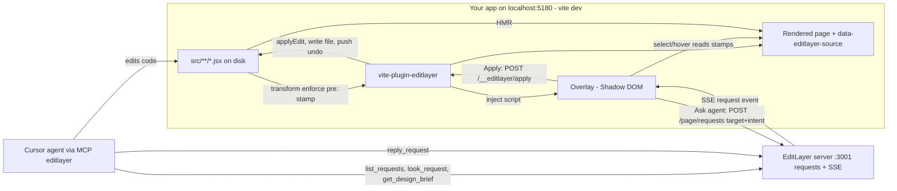
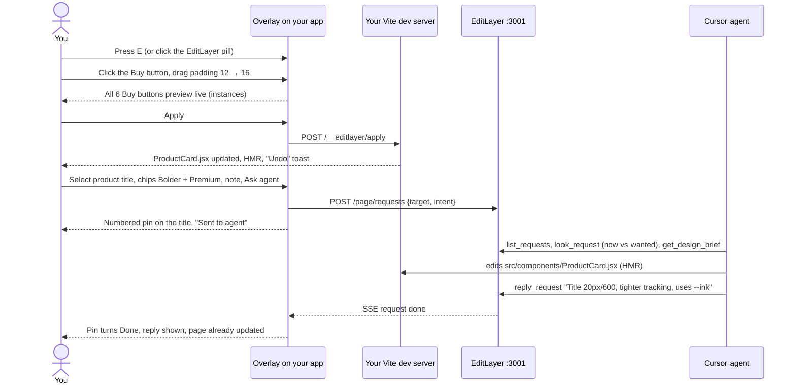

# EditLayer on your own app (project overlay)

The product promise: **Figma on top of the project you already have, without leaving
localhost**, plus a clear way to tell your agent how a component should look and feel.

Until now EditLayer only edited its own JSON pages (`demo`, `marketplace`). This work
makes it attach to any running React + Vite app.

| You want… | You do | What happens |
|-----------|--------|--------------|
| A small visual tweak (padding, color, text) | Select the element, drag a field, **Apply** | The change is written into the JSX source file on disk. Vite hot-reloads it. Costs zero prompts. **Undo** restores the file |
| A change that needs judgement ("make this card feel premium") | Select, preview tweaks, pick feel chips, write a note, **Ask agent** | A request with the exact source file:line, component, styles, your previewed tweaks, and feel lands in the agent's queue (MCP) |
| To know what the agent did | Keep the page open | A pin on the element flips to Done with the agent's reply. HMR shows the new code |

Non-Vite apps can add one `<script>` tag. They get select, inspect, and **Ask agent**
(identified by CSS selector), but not **Apply**.

---

## Definition of done (project level)

1. `examples/storefront`, an ordinary Vite React app that doesn't use EditLayer's JSON, runs with one plugin line.
2. In that app: select → tweak → **Apply** writes the source file, HMR shows it, and **Undo** restores it byte-for-byte.
3. **Ask agent** creates a request carrying `target.source`, `intent.changes`, and `intent.feel`. The MCP `look_request` returns before/after images. `reply_request` shows up on the page pin live.
4. Elements rendered from one JSX line (a `.map`) highlight as instances. Apply changes all of them, like editing a Figma main component.
5. A project brief (`editlayer.brief.md`) is editable from the overlay and readable by the agent (`get_design_brief`).
6. Existing gates stay green: `npm test`, `npm run check` (demo + marketplace ≥ 90), and the JSON editor unchanged.
7. Headings have real levels (`h1`–`h6`). This clears the known debt.

### Status: built

| DoD | Evidence |
|-----|----------|
| 1 | `examples/storefront/vite.config.js` is `plugins: [editlayer(), react()]` |
| 2–5 | `npm run e2e:overlay` (`scripts/overlay-e2e.mjs`) runs 14 steps in real Chrome and exits 0. It covers Apply → HMR → Undo byte-exact on `Hero.jsx`, ×6 instances rewritten from one line in `ProductCard.jsx`, `{name}` text refused with 422, Ask agent → request `target`/`intent` → `look_request` crops differ → reply toast + Done pin, and a brief saved from the overlay that `get_design_brief` reads back |
| 6 | `npm test` (108 tests, including the plugin and request-shape tests), `npm run check` (demo 100, marketplace 100) |
| 7 | `level` 1–6 on headings. Seeds use h2 for sections and h3 for cards. Review rule `heading-order` |

Found and fixed while integrating:

- `applyEdit` used stale offsets when it replaced and appended in the same style literal.
- The dev endpoints now answer only on a loopback `Host`, to block DNS rebinding.
- The plugin warns if it runs after `@vitejs/plugin-react`, because line numbers would shift.
- A refused undo keeps its stack entry.
- Overlay preview state: previews are a `Map`, and applied previews move onto a stack, so Undo restores inline values and text.
- The "from" values stay stable while you drag a field.
- Old done requests no longer toast on page load.
- Toasts no longer cover the panel.

Also shipped after the first cut: class-rule and `className` Apply, one undo step for every file in an Apply, undo persisted in `.editlayer/undo.json`, and `data-apply="server"` so a non-Vite page can Apply through :3001. A `var(--token)` edit stays on the selected rule.

---

## Tasks (ordered; A–E run in parallel, F after)

| # | Task | Owner files (only these) | Acceptance | Verify |
|---|------|--------------------------|------------|--------|
| A | Requests carry target + intent; agent tools | `shared/coworker/requestShape.js` (+test), `server/db.js`, `server/coworker.js`, `server/index.js` (serve overlay), `scripts/coworker/lib.mjs`, `scripts/coworker-mcp.mjs`, `scripts/coworker.mjs` | POST/list round-trips `target`/`intent`; bad shapes → 400; MCP `look_request`, `get_design_brief`; instructions cover source edits | unit tests; curl; MCP stdio smoke |
| B | Vite plugin: stamp, apply, undo, brief, inject | `packages/vite-plugin-editlayer/*` (+tests), root `package.json` devDeps only | Host JSX gets `data-editlayer-source` + `data-editlayer-component`; `applyEdit` handles the style cases + static text; refuses unsafe; path sandbox; undo stack | unit tests on fixtures |
| C | Overlay UI (vanilla, Shadow DOM) | `packages/overlay/*` | Toggle, hover, select, instances, inspector with live preview, Apply/Undo, Ask with feel chips, pins + live replies, brief tab, Esc/keyboard, reduced motion | loads in example app; no console errors; host styles unaffected |
| D | Example "already made" app | `examples/storefront/*` | Realistic app (nav, hero, product grid via `.map`, testimonial, footer), CSS classes + some inline styles, port 5180, plugin line in `vite.config.js`, sample brief | `npm run build` in example |
| E | Heading levels + heading-order rule | `shared/elementDefaults.js`, `shared/coworker/schema.js`, `shared/coworker/review.js`, `server/configToHtml.js`, `client/src/PageRenderer.jsx`, inspector heading field, `seeds/*`, goldens, tests | `level` 1–6 renders `h{n}` in editor + HTML; seeds use h2/h3 below the title; `heading-order` warns on skipped levels / multiple h1 | `npm test`; `npm run check` stays ≥ 90 |
| F | End-to-end + walkthrough | `scripts/overlay-e2e.mjs`, docs | Script drives the example app through DoD 2–4 in a real browser and exits 0 | run it; video |

---

## Contracts

### Source stamp (B writes, C reads)

In `vite serve` only, every **host** JSX element (lowercase tag) in files under the app
root, excluding `node_modules`, gets:

```html
data-editlayer-source="src/components/ProductCard.jsx:14:7"   <!-- root-relative path:line:column (1-based) of the opening `<` -->
data-editlayer-component="ProductCard"                        <!-- nearest enclosing function/const component name, if any -->
```

Positions refer to the **file on disk** (the plugin runs with `enforce: "pre"` on untransformed source).
Elements rendered from one JSX line share one stamp. They are *instances*.

### Dev-server endpoints (B implements in `configureServer`, C calls same-origin)

| Method | Path | Body → Response |
|--------|------|-----------------|
| `GET` | `/__editlayer/overlay.js` | serves `packages/overlay/overlay.js` (ES module) |
| `POST` | `/__editlayer/apply` | `{ source: "src/App.jsx:12:5", style?: { paddingTop: "20px", … }, text?: "New label" }` → `200 { ok: true, file, summary: "src/App.jsx: style paddingTop 20px", undoDepth }` · `409 { error: "element moved; reload" }` · `422 { error: "text is dynamic here; ask the agent" }` · `400/403` bad input / outside root |
| `POST` | `/__editlayer/undo` | `{}` → `200 { ok: true, file, undoDepth }` (restores the last applied file's previous content) · `409 { error: "nothing to undo" }` · `409 { error: "file changed since apply" }` (disk no longer matches what apply wrote; the entry stays on the stack) |

Every `/__editlayer/*` route returns `403` unless the `Host` header is loopback (`localhost`, `*.localhost`, `127.x.x.x`, `[::1]`). A request that carries an `Origin` must match the dev server's host. Browsers always send `Origin` on cross-site writes, so other sites can't call these routes. A local CLI with no `Origin` can.
| `GET` | `/__editlayer/brief` | `200 { path: "editlayer.brief.md", text }` (`text` = `""` if missing) |
| `PUT` | `/__editlayer/brief` | `{ text }` → `200 { ok: true }` |

`transformIndexHtml` injects:

```html
<script type="module" src="/__editlayer/overlay.js" data-api="http://localhost:3001" data-apply="true"></script>
```

Plugin options: `editlayer({ api = "http://localhost:3001", brief = "editlayer.brief.md" })`.
Style keys are camelCase CSS properties. Values are strings as written (`"20px"`, `"#111827"`, `"600"`).

**`applyEdit` rules** (pure function `applyEdit(code, { line, column }, { style, text })` → `{ code, summary }` or throws `{ status, message }`):

- Find the `JSXOpeningElement` whose `<` is at line:column. If there's none, throw 409.
- `style`:
  - A literal `style={{ … }}` object: set or replace those keys. Other keys, comments, and formatting are preserved.
  - `style={expr}` that isn't an object literal: rewrite as `style={{ ...expr, key: "v" }}`.
  - No `style` attribute: insert ` style={{ key: "v" }}` right after the tag name (and after any type args).
- `text`: only if the element's children are exactly one non-whitespace `JSXText`. Replace the trimmed text and keep the surrounding whitespace. Otherwise throw 422.
- Never touch anything outside the one element's opening tag and its single text child.
- JSX string escaping: `{`, `}`, `<`, `>` in text → wrap the text as `{"…"}`.

### Request shape (A validates; C sends; agent reads)

`POST http://localhost:3001/page/requests` (existing endpoint, now with optional fields):

```json
{
  "text": "Make this feel more premium",
  "target": {
    "url": "http://localhost:5180/",
    "selector": "main > section.products > article:nth-of-type(2) > h3",
    "source": { "file": "src/components/ProductCard.jsx", "line": 14, "column": 7 },
    "component": "ProductCard",
    "tag": "h3",
    "text": "Linen Overshirt",
    "instances": 6,
    "rect": { "x": 412, "y": 830, "width": 280, "height": 28 },
    "styles": { "color": "rgb(17, 24, 39)", "fontSize": "18px", "fontWeight": "600", "padding": "0px", "margin": "0px 0px 8px", "backgroundColor": "rgba(0, 0, 0, 0)", "borderRadius": "0px", "lineHeight": "26px", "gap": "normal" }
  },
  "intent": {
    "changes": { "fontSize": { "from": "18px", "to": "20px" }, "letterSpacing": { "from": "normal", "to": "-0.01em" } },
    "feel": ["bolder", "premium"]
  }
}
```

- `elementId` (the JSON board) and `target` (a real app) are mutually exclusive.
- Every `target` field is optional except `url`. `source` requires `file` (a relative path, no `..`), plus `line` and `column` as positive integers.
- `intent.changes` has at most 30 keys. Keys are camelCase CSS properties and values are `{from, to}` strings. `intent.feel` has at most 8 strings from `FEEL_WORDS`, or free words of 24 characters or fewer.
- `FEEL_WORDS` (exported by `requestShape.js`, used by C for chips): `tighter`, `airier`, `subtler`, `bolder`, `sharper`, `softer`, `calmer`, `livelier`, `premium`, `playful`.
- Stored as JSON columns `target` and `intent`. Returned on every request object as `target: {…} | null` and `intent: {…} | null`.

### Agent tools (A)

| MCP tool / CLI | Does |
|----------------|------|
| `list_requests` | as before, now with `target`/`intent` |
| `look_request {id}` | Opens `target.url` in headless Chrome and finds the element (source stamp first, then selector). Returns a text summary plus two PNG crops: **now** and **wanted** (with `intent.changes` applied as inline styles to every instance). CLI: `coworker look-request <id> [--out dir]` |
| `get_design_brief` | Reads `editlayer.brief.md` from `EDITLAYER_PROJECT_ROOT` (default `process.cwd()`). Returns its text, or guidance to create one |
| `reply_request` | as before |

MCP instructions add: a request with `target.source` is about **the user's real code**. Edit that file in the workspace, honor `intent.changes` literally, interpret `intent.feel` with the design brief, prefer the project's existing CSS classes and tokens over inline styles, then `look_request` again and reply with what changed.
Chrome path: `CHROME_PATH` env, else `/usr/local/bin/google-chrome`, else playwright's default.

---

## Data flow



## User experience



Before, you either spent a prompt on "make the button padding 16" or left the project for Figma.
After, small tweaks are direct edits to your code, and big asks reach the agent with everything it needs.
